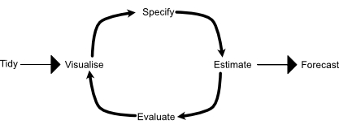

# 5.1 A tidy forecasting workflow



## Data preparation (tidy)

We will model GDP per capita over time; so first, we must compute the relevant variable.

```{r}
library(tidyverse)
library(fpp3)
gdppc <- global_economy %>% 
  mutate(GDP_per_capita = GDP / Population)
gdppc

```

## Plot the data (visualize)

```{r Plot the data for Sweden}
gdppc %>% 
  filter(Country == "Sweden") %>% 
  autoplot(GDP_per_capita) +
  labs( y = "$US", title = "GDP per capita for Sweden")

TSLM(GDP_per_capita ~ trend())
```

## Definte a model (specify)
There are many different time series models that can be used for forecasting, and much of this book is dedicated to describing various models. Specifying an appropriate model for the data is essential for producing appropriate forecasts. For example, a linear trend model (to be discussed in Chapter 7) for GDP per capita can be specified with:

```{r}
 fit <- gdppc %>%
   model(trend_model = TSLM(GDP_per_capita ~ trend()))
fit
```

## Check model performance

Once a model has been fitted, it is important to check how well it has performed on the data. There are several diagnostic tools available to check model behaviour, and also accuracy measures that allow one model to be compared against another.

## Produce forecasts (forecast)

```{r}

fit %>% forecast(h = "3 years")

```

```{r}
fit %>% 
  forecast(h = "3 years") %>% 
  filter(Country == "Sweden") %>% 
  autoplot(gdppc) +
  labs(y = "$US", title = "GDP per capita for Sweden")
```

