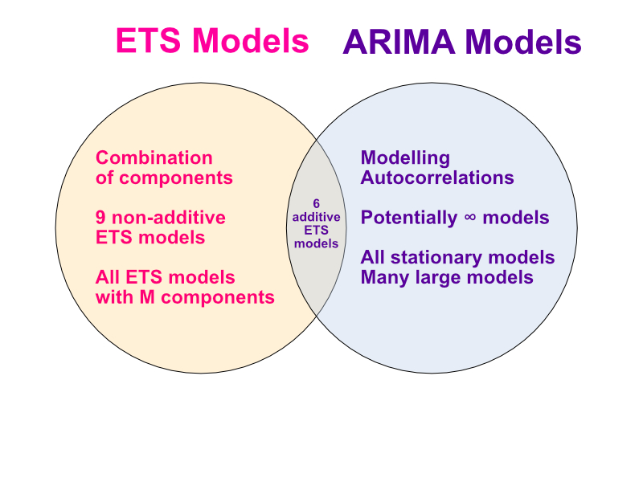

# 9. ARIMA models

ARIMA models provide another approach to time series forecasting. <mark>Exponential smoothing and ARIMA models are the two most widely used approaches to time series forecasting, and provide complementary approaches to the problem. While exponential smoothing models are based on a description of the trend and seasonality in the data, ARIMA models aim to describe the autocorrelations in the data.</mark>

Before we introduce ARIMA models, we must first discuss the concept of stationarity and the technique of differencing time series.


## 9.1 Stationarity and differencing

A stationary time series is one whose statistical properties do not depend on the time at which the series is observed.15 Thus, time series with trends, or with seasonality, are not stationary — the trend and seasonality will affect the value of the time series at different times. On the other hand, a white noise series is stationary — it does not matter when you observe it, it should look much the same at any point in time.

In general, a stationary time series will have no predictable patterns in the long-term. Time plots will show the series to be roughly horizontal (although some cyclic behaviour is possible), with constant variance.

## Differencing

Transformations such as logarithms can help to stabilise the variance of a time series. Differencing can help stabilise the mean of a time series by removing changes in the level of a time series, and therefore eliminating (or reducing) trend and seasonality.

As well as the time plot of the data, the ACF plot is also useful for identifying non-stationary time series. <mark>For a stationary time series, the ACF will drop to zero relatively quickly, while the ACF of non-stationary data decreases slowly. Also, for non-stationary data, the value of $r_1$ is often large and positive.</mark>

```{r Figure 9.2: The ACF of the Google closing stock price in 2015 (left) and of the daily changes in Google closing stock price in 2015 (right).}

library(tidyverse)
library(fpp3)

google_stock <- gafa_stock %>%
  filter(Symbol == "GOOG", year(Date) >= 2015) %>%
  mutate(day = row_number()) %>%
  update_tsibble(index = day, regular = TRUE)
# Filter the year of interest
google_2015 <- google_stock %>% filter(year(Date) == 2015)

google_2015 %>% 
  mutate(diff_close = difference(Close)) %>% 
  features(diff_close, ljung_box, lag = 10)

```

Let's look at an autocorrelation of the Close price of Goolge 2015 stock:

```{r Autocorrelation Function (ACF) of Google 2015 stock}

google_2015 %>% 
  ACF(Close) %>% 
  autoplot()
```

Let's look at a graph of the lag of the Close price of Google2015

```{r the daily changes in Google closing stock price in 2015}
google_2015 %>% 
  mutate(diff_close = difference(Close)) %>% 
  ACF(diff_close) %>% 
  autoplot()

```

The ACF of the differenced Google stock price looks just like that of a white noise series. <mark>Only one autocorrelation is outside of the 95% limits,</mark> and the Ljung-Box $Q^*$statistic has a p-value of 0.637 (for $h =$10). This suggests that the daily change in the Google stock price is essentially a random amount which is uncorrelated with that of previous days.

## Random walk model

The differenced series is the <i>change</i> between consecutive observations in the original series, and can be written as:

$y^{'}_t = y_t - y_{t-1}$<br>

The differenced series will have only $T - 1$ values, since it is not possible to calculate a difference, $y^{'}$ for the first observation.

When the differenced series is white noise, the model for the original series can be written as:

$y_t - y_{t-1} = \epsilon_t$<br>

where $\epsilon_t$ denotes white noise. Rearranging this leads to the "random walk" model,

$y_t = y_{t-1} + \epsilon_t$

<mark>Random walk models are widely used for non-stationary data, particularly financial and economic data.</mark> Random walks typically have:

• Long periiods of apparent trends up or down
• Sudden and unpredictable changes in direction

The forecasts from a random walk model are equal to the last observation, as future movements are unpredictable, and are equally likely to be up or down. Thus, the random walk model underpins naïve forecasts, first introduced in Section 5.2.

A closely related model allows the differences to have a non-zero mean. Then:

$y_t - y_{t-1} = c + \epsilon_t$ or $y_t = c + y_{t-1} + \epsilon_t$

The value of $c$ is the average of the changes between consecutive observations. If $c$ is positive, then the average change is an increase in the value of $y_t$. Thus, $y_t$ will tend to drift upwards. However, if $c$ is negative, $y_t$ will tend to drift downwards.

This is the model behind the drift method, also discussed in Section 5.2.

## Second-order differencing

Occasionally the differenced data will not appear to be stationary and it may be necessary to difference the data a second time to obtain a stationary series:

$y_t^{''} = y_t^{'} - y_{t-1}^{'}$<br>
${     } = (y_t - y_{t-1}) - (y_{t-1} - y_{t-2}))$<br>
${     } = y_t - 2y_{t-1} + y_{t-2}$

In this case, $y^{''}$ will have $T-2$ values. Then, we would model the "change in the changes" of the original data. <mark>In practice, it is almost never necessary to go beyond second-order differences.</mark>

## Seasonal differencing

A seasonal difference is the difference between an observation and the previous observation from the same season. So:

$y_t^{'} = y_t - y_{t-m},$

where $m$= the number of seasons.These are also called "lag-m differences," as we subtract the observation after a lag of $m$ periods.

If the seasonally differenced data appear to be white noise, then an appropriate model for the original data is:

$y_t = y_{t-m} + \epsilon_t$<br>

Forecasts from this model are equal to the last observation from the relevant season. That is, <mark>this model gives seasonal näive forecasts, introduced in Section 5.2</mark>

To distinguish seasonal differences from ordinary differences, we sometimes refer to ordinary differences as “first differences,” meaning differences at lag 1.

Sometimes it is necessary to take both a seasonal difference and a first difference to obtain stationary data. Figure 9.4 plots Australian corticosteroid drug sales ($AUD) (top panel). Here, the data are first transformed using logarithms (second panel), then seasonal differences are calculated (third panel). The data still seem somewhat non-stationary, and so a further lot of first differences are computed (bottom panel).

```{r Figure 9.4: Top panel: Corticosteroid drug sales ($AUD).}

PBS %>% 
  filter(ATC2 == "H02") %>% 
  summarise(Cost = sum(Cost)/1e6) %>% 
  transmute(
    `Sales ($million)` = Cost,
    `Log sales` = log(Cost),
    `Annual change in log sales` = difference(log(Cost), 12),
    `Doubly differenced log sales` = difference(difference(log(Cost), 12), 1)
    ) %>% 
  pivot_longer(-Month, names_to = "Type", values_to = "Sales") %>% 
  mutate(
    Type = factor(Type, levels = c(
      "Sales ($million)",
      "Log sales",
      "Annual change in log sales",
      "Doubly differenced log sales"))
  ) %>% 
  ggplot(aes(x = Month, y = Sales)) +
  geom_line() +
  facet_grid(vars(Type), scales = "free_y") +
  labs(title = "Corticosteroid drug sales", y = NULL)

```

There is a degree of subjectivity in selecting which differences to apply. The seasonally differenced data in Figure 9.3 do not show substantially different behaviour from the seasonally differenced data in Figure 9.4. In the latter case, we could have decided to stop with the seasonally differenced data, and not done an extra round of differencing. In the former case, we could have decided that the data were not sufficiently stationary and taken an extra round of differencing. Some formal tests for differencing are discussed below, but there are always some choices to be made in the modelling process, and different analysts may make different choices.

If $y_t^{'} =y_t - y_{t-m}$ denotes a seasonally differenced series, then the twice-differenced series is:

$y_t^{''} = y_t^{'} - y_{t-1}^{'}$<br>
$= (y_t - y_{t-m}) - (t_{t-1} - y_{t - m - 1})$<br>
$= y_t - y_{t-1} - y_{t-m} + y_{t-m-1}$<br>

When both seasonal and first differences are applied, it makes no difference which is done first—the result will be the same. <mark>However, if the data have a strong seasonal pattern, we recommend that seasonal differencing be done first, because the resulting series will sometimes be stationary and there will be no need for a further first difference.</mark> If first differencing is done first, there will still be seasonality present.

Beware that applying more differences than required will induce false dynamics or autocorrelations that do not really exist in the time series. Therefore, <mark>do as few differences as necessary to obtain a stationary series.</mark>

It is important that if differencing is used, the differences are interpretable. First differences are the change between one observation and the next. Seasonal differences are the change between one year to the next. Other lags are unlikely to make much interpretable sense and should be avoided.

## Unit root tests

One way to determine more objectively whether differencing is required is to use a <i>unit root test</i>. These are statistical hypothesis tests of stationarity that are designed for determining whether differencing is required.

Let's apply the <i>Kwiatkowski-Phillips-Schmidt-Snit (KPSS)</i> test to the Goolge 2015 stock price data. In this test, the null hypothesis is that the data are stationary, and we look for evidence that the null hypothesis is false. Consequently, small p-values (e.g., less than 0.05) suggest that differencing is required. The test can be computed using the `unitroot_kpss()` function.

```{r Test the google 2015 stock price to test if differencing is required}
google_2015 %>% 
  features(Close, unitroot_kpss)

```

The p-value is reported as 0.01 if it is less than 0.01, and as 0.1 if it is greater than 0.1. In this case, the test statistic (3.56) is bigger than the 1% critical value, so the p-value is less than 0.01, indicating that the null hypothesis is rejected. That is, the data are not stationary. We can difference the data, and apply the test again.

```{r}
google_2015 %>% 
  mutate(diff_close = difference(Close)) %>% 
  features(diff_close, unitroot_kpss)
```

This time, the test statistic is tiny, and well within the range we would expect for stationary data, so the p-value is greater than 0.1. We can conclude that the differenced data appear stationary.

This process of using a sequence of KPSS tests to determine the appropriate number of first differences is carried out using the `unitroot_ndiffs()` feature.

```{r}
google_2015 %>% 
  features(Close, unitroot_ndiffs)
```

As we saw from the KPSS tests above, one difference is required to make the `google_2015` data stationary.

A similar feature for determining whether seasonal differencing is required is `unitroot_nsdiffs()`, which uses the measure of seasonal strength introduced in Section 4.3 to determine the appropriate number of seasonal differences required. No seasonal differences are suggested if  $F_s \lt 0.64$, otherwise one seasonal difference is suggested.

We can apply the `unitroot_nsdiffs()` to the monthly total Australian retail turnover.

```{r}
aus_total_retail <- aus_retail %>% 
  summarise(Turnover = sum(Turnover))

aus_total_retail %>% 
  mutate(log_turnover = log(Turnover)) %>% 
  features(log_turnover, unitroot_nsdiffs)

```


```{r}
aus_total_retail %>% 
  mutate(log_turnover = difference(log(Turnover), 12)) %>% 
  features(log_turnover, unitroot_nsdiffs)
```

Because `unitroot_nsdiffs()` returns 1 (indicating one seasonal difference is required), we apply the `unitroot_ndiffs()` function to the seasonally differenced data. These functions suggest we should do both a seasonal difference and a first difference.

## 9.2 Backshift notation

The backward shift operator $B$ is a useful notational device when working with time series lags:

$B_{y_{t}} = y_{t-1}$

In other words, $B$, operating on $y_t$, has the effect of shifting the data back one period. Two applications of $B$ to $y_t$ shifts the data back two periods:

$B(B_{y_{t}}) = B^2y_t = y_{t-2}$

For monthly data, if we wish to consider "the same month last year," the notation is $B^{12}y_t = y_{t -12}$

The backward shift operator is convenient for describing the process of <i>differencing</i>. The first difference can be written as:

$y_t^{'} = y_t - y_{t-1} = y_t - By_t = (1 - B)y_t$

So the first difference can be represented by $(1 - B)$. Similary, if second-order differences have to be computed, then:

$y_t^{''} = y_t - 2y_{t-1} + y_{t-2} = (1 - 2B + B^2)y_t = (1 - B)^2y_t$

In general, the dth-order difference can be written as:

$(1 - B)^d y_t$

Backshift notation is particularly useful when combining differences, as the operator can be treated using ordinary algebraic rules. In particular, terms involving $B$ can be multiplied together.

## 9.3 Autoregressive models

In a multiple regression model, introduced in Chapter 7, we forecast the variable of interest using a linear combination of predictors. In an autoregression model, we forecast the variable of interest using a linear combination of <i>past values of the variable</i>. The term autoregression indicates that it is a regression of the variable against itself.

Thus, an autoregressive model of order $p$ can be written as:

$y_t = c + \phi_1y_{t-1} + \phi_2y_{t-2} + ... + \phi_py_{t-p} + \epsilon_t$

where $\epsilon_t$ is white noise. This is like a multiple regression but with lagged values of $y_t$ as predictors. We refer to this as an <b>AR($p$)</b> model, an autoregressive model of order $p$.

Autoregressive models are remarkably flexible at handling a wide range of different time series patterns. The two series in Figure 9.5 show series from an AR(1) model and an AR(2) model. Changing the parameters $\phi_1,...\phi_p$ results in different time series patterns. The variance of the error term $\epsilon_t$ will only change the scale of the series, not the patterns.

For an AR(1) model:

• when $\phi_1 = 0 $ and $c = 0, y_t $ is equivalent to white noise;<br>
• when $\phi_1 = 1 $ and $c = 0, y_t $ is equivalent to a random walk;<br>
• when $\phi_1 = 1 $ and $c\ne0, y_t $ is equivalent to a random walk with drift;<br>
• when $\phi_1 \lt 0, y_t$ tends to oscillate around the mean.

We normally restrict autoregressive models to stationary data, in which case some constraints on the values of the parameters are required:

• For an AR(1) model: $-1 \lt \phi_1 \lt 1$<br>
• For an AR(2) model: $-1 \lt \phi_2 \lt1, \phi_1 +\phi_2 \lt 1, \phi_2 - \phi_1 <1$

When $p \geq3$, the restrictions are much more complicated. The `fable` package takes care of these restrictions when estimating a model.

## 9.4 The moving average models

Rather than using past values of the forecast variable in a regression, a moving average model uses past forecast errors in a regression-like model,

$y_t = c + \epsilon_t + \theta_1 \epsilon_{t-1} +\theta_2 \epsilon_{t-2} +\theta_q \epsilon_{t-q}$

where $\epsilon_t$ is white noise. We refer to this as an <b>MA(q) model</b>, a moving average model of order $q$. Of course, we do not <i>observe</i> the value of $\epsilon_t$, so it is not really a regression in the usual sense.

Notice that each value of $y_t$ can be thought of as a weighted moving average of the past few forecast errors (although the coefficients will not normally sum to one). However, moving average models should not be confused with the moving average smoothing we discussed in Chapter 3. <mark>A moving average model is used for forecasting future values, while moving average smoothing is used for estimating the trend-cycle of past values.</mark>

Figure 9.6 shows some data from an MA(1) model and an MA(2) model. Changing the parameters $\theta_1,...,\theta_q$ results in different time series patterns. As with autoregressive models, the variance of the error term $\epsilon_t$ will only change the scale of the series, not the patterns.

It is possible to write any stationary AR($p$) model as an MA($\infty$) model. For example, using repeated substitution, we can demonstrate this for an AR(1) model:

$y_t = \phi y_{t-1} + \epsilon_t$<br>
$\phi_1(\phi_1 y_{t-2} + \epsilon_{t-1}) + \epsilon_t$<br>
$\phi_1^2 y_{t-2} + \phi \epsilon_{t-1} + \epsilon_t$<br>
$\phi_1^3 y_{t-3} + \phi^2 \epsilon_{t-2} + \phi_1\epsilon_{t-1} + \epsilon_t$<br>
etc.

Provided $-1 \lt \phi_1 \lt 1$ the value of $\phi_1^k$ will get smaller as $k$ gets larger. So eventually we obtain:

$y_t = \epsilon_t + \phi_1 \epsilon_{t-1} + \phi_1^2 \epsilon_{t-2} + \phi_1^3 \epsilon_{t-3} + ...,$

am MA($\infty$) process.

The reverse result holds if we impose some constraints on the MA parameters. Then the MA model is called <b>invertible</b>. That is, we can write any invertible MA($q$) process as an AR($\infty$) process. Invertible models are not simply introduced to enable us to convert from MA models to AR models. They also have some desirable mathematical properties.

For example, consider the MA(1) process, $y_t = \epsilon_t + \theta_1 \epsilon_{t-1}$. In its AR($\infty$) representation, the most recent error can be written as a linear function of current and past observations:

$\epsilon_t = \sum_{j=0}^\infty (-\theta_1)^j y_{t-j}$

When $\left| \theta_1 \right|\gt 1$, he weights increase as lags increase, so the more distant the observations the greater their influence on the current error. When $\left| \theta_1 \right| = 1$ the weights are constant in size, and the distant observations have the same influence as the recent observations. As neither of these situations make much sense, we require $\left| \theta_1 \right| \lt 1$ so the most recent observations have higher weight than observations from the more distant past. Thus, the process is invertible when $\left| \theta_1 \right| \lt 1$.

The invertaibility constraints for other models are similar to the stationarity constraints.

•For an MA(1) model: $-1 \lt \theta_1 \lt 1$<br>
•For an MA(2) model: $-1 \lt \theta_2 \lt 1, \theta_2 + \theta_1 \gt -1, \theta_1 - \theta_2 \lt 1$<br>

More complicated conditions hold for $q \ge 3$. Again, the `fable` package will take care of these constraints when estimating the models.

# 9.5 Non-seasonal ARIMA models

If we combine differencing with autoregression and a moving average model, we obtain a non-seasonal ARIMA model. ARIMA is an acronym for AutoRegressive Integrated Moving Average (in this context, “integration” is the reverse of differencing). The full model can be written as

$y_t^{'} = c + \phi_1y_{t-1}^{'}+...+\phi_py_{t-p}^{'} + \theta_1\epsilon_{t-1} + ... +\theta_q\epsilon_{t-q} + \epsilon_t$<br>

where $y'_{t}$ is the differenced series (it may have been differenced more than once). The “predictors” on the right hand side include both lagged values of $y_t$ and lagged errors. We cal this an <b>ARIMA(p, d, q) model</b> where

||
|:-----:|
|$p$ = the order of the autoregressive part|
|$d$ = degree of the first differencing involved|
|$p$ = order of the moving average part|

The same stationarity and invertibility conditions that are used for autoregressive and moving average models also apply to an ARIMA model.

Many of the models we have already discussed are special cases of the ARIMA model, as shown in Table 9.1.

<center>Table 9.1: Special cases of ARIMA models.</center>
|||
|:-----:|:-----:|
|White noise|ARIMA(0,0,0) with no constant|
|Random walk|ARIMA(0,1,0) with no constant|
|Random walk with drift|ARIMA(0,1,0) with a constant|
|Autoregression|ARIMA($p$,0,0)|
|Moving average|ARIMA(0,0,$q$)|

Once we start combining components in this way to form more complicated models, it is much easier to work with the backshift notation. For example, Equation (9.1) can be written in backshift notation as

$(1 - \phi_1B - \cdots - \phi_pB^p) \quad (1-B)^d y_t \quad= \quad c +(1 + \theta_1B + \cdots + \theta_qB^q) \epsilon_t$

$\qquad \qquad \uparrow \qquad \qquad \qquad  \quad \uparrow \qquad \qquad \qquad \quad \qquad \uparrow$

$\qquad \quad AR(p) \qquad \qquad \text{d-differences} \qquad \qquad \qquad MA(q)$

Selecting appropriate values for $p, d, \text{and } q$can be difficult. However, the `ARIMA()` function from the `fable` package will do it for you automatically. In Section 9.7, we will learn how this function works, along with some methods for choosing these values yourself.

## Egyptian exports example

Figure 9.7 shows Egyptian exports as a percentage of GDP from 1960 to 2017.

```{r Figure 9.7: Annual Egyptian exports as a percentage of GDP since 1960.}

global_economy %>% 
  filter(Code == "EGY") %>% 
  autoplot(Exports) +
  labs(y = "% of GDP", title= "Egyptian Exports")

```

The following R code selects a non-seasonal ARIMA model automatically:

```{r Selecting a non-seasonal ARIMA code automatically}
fit <- global_economy %>% 
  filter(Code == "EGY") %>% 
  model(ARIMA(Exports))
report(fit)

```

This is an ARIMA(2,0,1) model, where:

$y_t = 2.5623 + 1.6764y_{t-1} - 0.8034 y_{t-2} - 0.6896 \epsilon_{t-1} + \epsilon_t$<br>

where $\epsilon_t$ is white noise with a standard deviation of 2.837 = $\sqrt{8.046}$. Forecasts from the model are shown in Figure 9.8. Notice how they have picked up the cycles evident in the Egyptian economy over the last few decades.

```{r Forecasts from ARIMA(2, 0, 1) model of Eqyptian exports}

fit %>% forecast(h = 10) %>% 
  autoplot(global_economy)+
  labs(y = "% of GDP", title = "Egyptian Exports")

```

## Understanding ARIMA models

The `ARIMA()` function is useful, but anything automated can be a little dangerous, and is worth understanding something of the behavior of the models even when you rely on an automatic procedure to choose the model for you.

The constant $c$ has an important effect on the long-term forecasts obtained from these results

• If $c = 0 \text{ and } d = 0$, the long-term forecasts will go to zero.<br>
• If $c = 0 \text{ and } d = 1$, the long-term forecasts will go to a non-zero constant.<br>
• If $c = 0 \text{ and } d = 2$, the long term foreasts will follow a straight line.<br>
• If $c \ne 0 \text{ and } d = 0$, the long-term forecasts will go to the mean of the data.<br>
• If $c \ne 0 \text{ and } d = 1$, the long term forecasts will follow a straight line.<br>
• If $c \ne 0 \text{ and } d = 2$, the long-term forecasts will follow a quadratic trend. This is not recommended, and `fable` will not permit it.)<br>

The value of $d$ also has an effect on the prediction intervals — the higher the value of  $d$, the more rapidly the prediction intervals increase in size. For  $d = 0$, the long-term forecast standard deviation will go to the standard deviation of the historical data, so the prediction intervals will all be essentially the same.

This behaviour is seen in Figure 9.8 where $d = 0 $and $c \ne 0$ . In this figure, the prediction intervals are almost the same width for the last few forecast horizons, and the final point forecasts are close to the mean of the data.

The value of $p$ is important if the data show cycles. To obrain cyclic forecasts, it is necessary to have $p \ge 2$, along with some additoionla conditions on the parameters. For an AR(2) mode, cyclic bhaviour occurs is $\phi_1^2 + 4 \phi_2 \lt 0 (as is the case for the Egyptian Exports model).$ In that case, the average period of the cycles is:

<center><h2>$\frac{2\pi}{\text{arc cos}(-\phi_1(1 - \phi_2)/(4phi_2))}$</h2></center>

## ACF and PACF plots

It is usually not possible to tell, simply from a time plot, what values of $p$ and $q$ are appropriate for the data. However, it is sometimes possible to use the ACF plot, and the closely related PACF plot, to determine appropriate values for $p$ and $q$.

Recall that an ACF plot shows the autocorrelations which measure the relationship between $y_t$ and $y_{t-k}$ for different values of $k$. Now if $y_t$ and $y_{t-1}$ are correlated, then $y_{t-1}$ and $y_{t-2}$ must also be correlated. However, then $y_t$ and $t_{t-2}$ might be correlated, simply because they are both connected to $t_{t-1}$, rather than because of any new information contained in $y_{t-2}$ that could be used in forecasting $y_t$

To overcome this problem, we can use <b>partial autocorrelations</b>. These measure the relationship between $y_t$ and $y_{t-k}$ after removing the effects of lags 1, 2, 3, ..., k-1. So the first partial autocorrelation is identical to the first autocorrelation, because there is nothing between them to remove. Each partial autocorrelation can be estimated as the last coefficient in an autoregressive model. Specifically, $\alpha_k$, the $k$th partial autocorrelation coefficient, is equal to the estimate of $\phi_k$ in an AR(k) model. In practice, there are more efficeint algorithms for computing $\alpha_k$ than fitting all of these autoregressions, but they give the same results.

Figures 9.9 and 9.10 shows the ACF and PACF plots for the Egyptian exports data shown in Figure 9.7. The partial autocorrelations have the same critical values of $\pm 1.96 / \sqrt{T}$ as for ordinary autocorrelations, and these are typically shown on the plot as in Figure 9.10.

```{r Figure 9.9: ACF of Egyptian exports.}
global_economy %>% 
  filter(Code == "EGY") %>% 
  ACF(Exports) %>% 
  autoplot()

```

```{r Figure 9.10: PACF of Egyptian exports}
global_economy %>% 
  filter(Code == "EGY") %>% 
  PACF(Exports) %>% 
  autoplot()

```

A convenient way to produce a time plot, ACF plot and PACF plot in one command is to use the `ggtsdisplay()` function with `plot_type = "partial`.

```{r}
global_economy %>% 
  filter(Code == "EGY") %>% 
  gg_tsdisplay(difference(Exports), plot_type = 'partial')
```


If the data are from an ARIMA($p, d, 0$) or ARIMA($0, d, q$) model, then the ACF and PACF plots can be helpful in determining the value of $p$ or $q$. If $p$ and $q$ are both positive, then the plots do not help in finding suitable values of $p$ and $q$.

The data may follow an ARIMA($p, d, 0$) model if the ACF and PACF plots of the differenced data show the following patterns:

• the ACF is exponentially decaying or sinusoidal;
• there is a significant spike at lag $p$ in the PACF, but none beyond lag $p$.
 .
The data may follow an ARIMA(0, $d, q$) model if the ACF and PACF plots of the differenced data show the following patterns:

• the PACF is exponentially decaying or sinusoidal;
• there is a significant spike at lag $q$in the ACF, but none beyond lag $q$.

In Figure 9.9, we see that there is a decaying sinusoidal pattern in the ACF, and in Figure 9.10 the PACF shows the last significant spike at lag 4. This is what you would expect from an ARIMA(4,0,0) model.

```{r}
fit2 <- global_economy %>% 
  filter(Code == "EGY") %>% 
  model(ARIMA(Exports ~ pdq(4,0,0)))
report(fit2)

```

This model is only slightly worse than the ARIMA(2,0,1) model identified by `ARIMA()` (with an AICc value of 294.70 compared to 294.29).

## 9.6 Estimation and order selection

### Maximum likelihood estimation

Once the model order has been identified (i.e. the values of $p, d, \text{ and }q$), we need to estimate the paramaters $c, phi_1,,...,phi_p, \theta_1,...\theta_q$. When `fable` estimates the ARIMA model, it uses <i>maximum liklihood estimation</i> (MLE). This technique finds the values of the parameters which maximize the probability of obtaining the data that we have observed. For ARIMA models, MLE is similar to the <i>least squares</i> estimates that would be obtained by minimizing

<h4><center>$\sum_{t = 1}^T \epsilon_t^2$</center></h4>

(For the regression models considered in Chapter 7, MLE gives exactly the same parameter estimates as least squares estimation.) Note that ARIMA models are much more complicated to estimate than regression models, and different software will give slightly different answers as they use different methods of estimation, and different optimization algorithms.

In practice, the `fable` package will report the value of the <i>log likelihood</i> of the data; that is, the logarithm of the probability of the observed data coming from the estimated model. For given values of $p, d \text{ and } q$, `ARIMA()` will try to maximixe the log likelihood when finding parameter estimates.

### Information Criteria

Akaike’s Information Criterion (AIC), which was useful in selecting predictors for regression (see Section 7.5), is also useful for determining the order of an ARIMA model. It can be written as

<h4><center>$AIC = -2log(L) + 2(p + q + k + 1)$</center></h4>

where $L$ is the likelihood of the data, $k = 1$ if $c \ne 0$ and $k = 0$ if $c = 0$. Note that the last term in parentheses is the number of parameters in the model (including $\sigma^2$), the variance of the residuals.

For ARIMA models, the corrected AIC can be written as:

<center><h4>$AIC_c = AIC + \frac{2(p+q+k+1)(p+q+k+2)}{T-p-q-k-2}$</h4></center>

and the Bayesian Information Criterion can be written as:

<h4><center>$BIC = AIC + [log(T) - 2](p+q+k+1)$</center></h4>

Good models are obtained by minimizing the AIC, AICc or BIC. Our preference is to use the AICc.

It is important to note that these information criteria tend not to be good guides to selecting the appropriate order of differencing ($d$) of a model, but only for selecting the values of $p$ and $q$. This is because the differencing changes the data on which the likelihood is computed, making the AIC values between models with different orders of differencing not comparable. So we need to use some other approach to choose $d$, and then we can use the AICc to select $p$ and $q$.

Completion through section 9.6

#9.7 ARIMA modelling in `fable`

### How does `ARIMA()` work?

The `ARIMA()` model in the `fable` package uses a variation of the Hyndma = Khandakar algorighm (Hyndman & Khandakar, 2008), whic combines unit root tests, minimisation of AICc and MLE to obtain an ARIMA model. The arguemnts to `ARIMA()` provide for many variations on the algorithm What is described here is the defaul behavior.

||
|:-----:|
|<b>Hundmak-Khandakar Algorithm for automatic ARIMA modelling|<br></b>|
1. The number of differences $0 \le d \le 2$ is determined using repeated KPSS tests<br>
2. The values of $p$ and $q$ are then chosen by minising the AICc after differencing the data $s$ times. Rather than considering every possible combination of $p$ and $q$, the algorithm uses a stepwise search to traverse the model space.<br>
$\qquad$ a. Four initial models are fitted:<br>
$\qquad \qquad$ARIMA(0, d, 0)<br>
$\qquad \qquad$ARIMA(2, d, 2)<br>
$\qquad \qquad$ARIMA(1, d, 0)<br>
$\qquad \qquad$ARIMA(0, d, 1)<br>
$\qquad \qquad$A constant is included unless:<br>
$\qquad \qquad$d = 2. If $d \le 1$, an additional model is also fitted:<br>
$\qquad \qquad$ ARIMA(0, d, 0) without a constant<br>
$\qquad$b. The best model (with the smallest AICc value) fitted in step (a) is set to be the "current model"
<br><br>
$\qquad$c. Variations on the current model are considered:<br>
$\qquad \qquad$vary $p$ and/or $q$ from the current model by $\pm 1$;<br>
$\qquad \qquad$include/exclude $c$ from the current model.<br>
$\qquad \qquad$The best model considered so far (either the current model or one of these variations) becomes the new current model.
<br><br>
$\qquad$d. Repeat Step 2(c) until no lower AICc can be found

## Modelling procedure

When fitting an ARIMA model to a set of (non-seasonal) time series data, the following procedure provides a useful general approach.

1. Plot the data and identify any unusual observations.<br>
2. If necessary, transform the data (using a Box-Cox transformation) to stabilize the variance.<br>
3. If the data are non-stationary, take first differences of the data until the data are stationary.<br>
4. Examine the ACF/PACF: Is an ARIMA($p, d, 0$) or an ARIMA($0, d,q$) model appropriate?<br>
5. Try your chosen model(s), and use the AICc to search for a better model.<br>
6. Check the residuals from your chosen model by plotting the ACF of the residuals, and doing a portmanteau test of the residuals. If they do not look like white noise, try a modified model.<br>
7. Once the residuals look like white noise, calculate forecasts.

The Hyndman-Khandakar algorithm only takes care of steps 3–5. So even if you use it, you will still need to take care of the other steps yourself.

### Example: Central African Republic Exports

We will apply this procedure to the exports of the Central African Republic shown in Figure 9.13.

```{r Figure 9.13: Exports of the Central African Republic as a percentage of GDP.}
global_economy %>% 
  filter(Code =="CAF") %>% 
  autoplot(Exports) +
  labs(title = "Central African Republic exports",
       y = "% of GDP")
```

1. The time plot shows some non-stationarity, with an overall decline. The improvement in 1994 was due to a new government which overthrew the military junta and had some initial success, before unrest caused further economic decline.

2. There is no evidence of changing variance, so we will not do a Box-Cox transformation.

3. To address the non-stationarity, we will take a first difference of the data. The differenced data are shown in Figure 9.14.

```{r Figure 9.14: Time plot and ACF and PACF plots for the differenced Central African Republic Exports.}

global_economy %>% 
  filter(Code == "CAF") %>% 
  gg_tsdisplay(difference(Exports), plot_type='partial')

```

These now appear to be stationary.

The PACF shown in Figure 9.14 is suggestive of an AR(2) model; so an initial candidate model is an ARIMA(2,1,0). The ACF suggests an MA(3) model; so an alternative candidate is an ARIMA(0,1,3).

We fit both an ARIMA(2,1,0) and an ARIMA(0,1,3) model along with two automated model selections, one using the default stepwise procedure, and one working harder to search a larger model space.

```{r Looking for optimal models for Central African exports data}
caf_fit <- global_economy %>% 
  filter(Code == "CAF") %>% 
  model(
    arima210 = ARIMA(Exports ~ pdq(2,1,0)),
    arima013 = ARIMA(Exports ~ pdq(0,1,3)),
    stepwise = ARIMA(Exports),
    search = ARIMA(Exports, stepwise = FALSE))

caf_fit %>% pivot_longer(!Country, names_to = "Model name", values_to = "Orders")

glance(caf_fit) %>% arrange(AICc) %>% select(.model:BIC)

```

The four models have almost identical AICc values. Of the models fitted, the full search has found that an ARIMA(3,1,0) gives the lowest AICc value, closely followed by the ARIMA(2,1,0) and ARIMA(0,1,3) — the latter two being the models that we guessed from the ACF and PACF plots. The automated stepwise selection has identified an ARIMA(2,1,2) model, which has the highest AICc value of the four models.

6. The ACF plot of the residuals from the ARIMA(3,1,0) model shows that all autocorrelations are within the threshold limits, indicating that the residuals are behaving like white noise.

```{r Figure 9.15: Residual plots for the ARIMA(3,1,0) model.}
caf_fit %>% 
  select(search) %>% 
  gg_tsresiduals()

```

A portmanteau test returns a large p-value, also suggesting that the residuals are white noise.

```{r calculate portmanteau}
augment(caf_fit) %>% 
  filter(.model=='search') %>% 
  features(.innov, ljung_box, lag = 10, dof = 3)

```

7. Forecasts from the chosen model are shown in figure 9.16

```{r Forecasts of Central African Republic exports}
caf_fit %>% 
  forecast(h = 5) %>% 
  filter(.model=='search') %>% 
  autoplot(global_economy)
```

Note that the mean forecasts look very similar to what we would get with a random walk (equivalent to an ARIMA(0,1,0)). The extra work to include AR and MA terms has made little difference to the point forecasts in this example, although the prediction intervals are much narrower than for a random walk model.

## 9.9 Seasonal ARIMA models

So far, we have restricted our attention to non-seasonal data and non-seasonal ARIMA models. However, ARIMA models are also capable of modelling a wide range of seasonal data.

A seasonal ARIMA model is formed by including additional seasonal terms in the ARIMA models we have seen so far. It is written as follows:

<center>$\text{ARIMA} \qquad (p,d,q)\qquad \qquad (P,D,Q)_m$</center>
<pre><center>$ \uparrow \uparrow$</center></pre>
<center>$\qquad \quad \qquad \text{Non-seasonal part}\qquad \text{Seasonal part}$</center>

where $m$ = the seasonal period (e.g. the number of observations per year). We use uppercase notation for the seasonal parts of the model, and lowercase notation for the non-seasonal parts of the model.

The seasonal parts of the model consists of terms that are similar to the non-seasonal components of the model, but involve backshifts o fthe seasonal period. For example, an ARIMA(1,1,1)(1,1,1)$_4$ model (without a constant) is for quarterly data ($m$=4), and can be written as:

$(1 - \phi_1B)(1 - \Phi_1B^4)(1 - B)(1 - B^4)y_t = (1 + \theta_1B)(1 + \Theta_1B^4)\epsilon_t$<br>

The additional seasonal terms are multiplied by the non-seasonal terms,

## ACF/PACF

The seasonal part of an AR or MA model will be seen in the seasonal lags of the PACF and ACF. For example, an $ \text{ARIMA}(0,0,0)(0,0,1)_{12}$

model will show:

    • a spike at lag 12 in the ACF but no other significant spikes;
    • exponential decay in the seasonal lags of the PACF (i.e., at lags 12, 24, 36, …).

Similarly, an $\text{ARIMA}(0,0,0)(1,0,0)_{12}$

model will show:

    • exponential decay in the seasonal lags of the ACF;
    • a single significant spike at lag 12 in the PACF.

In considering the appropriate seasonal orders for a seasonal ARIMA model, restrict attention to the seasonal lags.

The modelling procedure is almost the same as for non-seasonal data, except that we need to select seasonal AR and MA terms as well as the non-seasonal components of the model. The process is best illustrated via examples.

## Example: MOnthly US leisure and hospitality employment

We will describe seasonal ARIMA modelling using monthly US employment data for leisure and hospitality jobs from January 2000 to September 2019, shown in Figure 9.18.

```{r  Figure 9.18: Monthly US leisure and hospitality employment, 2000-2019.}
leisure <- us_employment %>% 
  filter(Title == "Leisure and Hospitality",
         year(Month) > 2000) %>% 
  mutate(Employed = Employed/1000) %>% 
  select(Month, Employed)
autoplot(leisure, Employed) +
  labs(title = "US Employment: Leisure and hospitality",
       y = "Number of people (millions)")

```

The data are clearly non-stationary, with strong seasonality and a nonlinear trend, so we will first take a seasonal difference. The seasonally differenced data are shown in Figure 9.19.

```{r  Figure 9.19: Seasonally differenced Monthly US leisure and hospitality employment.}
leisure %>% 
  gg_tsdisplay(difference(Employed, 12),
               plot_type = 'partial', lag = 36) +
  labs(title = "Seasonally differenced")
```

These are also clearly non-stationary, so we take a further first difference in Figure 9.20.

```{r  Figure 9.20: Double differenced Monthly US leisure and hospitality employment.}

leisure %>% 
  gg_tsdisplay(difference(Employed, 12) %>%  difference(), plot_type = 'partial', lag = 36) +
  labs(title = "Double differenced", y="")

```

Our aim now is to find an appropriate ARIMA model based on the ACF and PACF shown in Figure 9.20. The significant spike at lag 2 in the ACF suggests a non-seasonal MA(2) component. The significant spike at lag 12 in the ACF suggests a seasonal MA(1) component. Consequently, we begin with an $\text{ARIMA}(0,1,2)(0,1,1)_{12}$ model, indicating a first difference, a seasonal difference, and non-seasonal MA(2) and seasonal MA(1) component. If we had started with the PACF, we may have selected an $\text{ARIMA}(2,1,0)(0,1,1)_{12}$ model — using the PACF to select the non-seasonal part of the model and the ACF to select the seasonal part of the model. We will also include an automatically selected model. By setting stepwise=FALSE and approximation=FALSE, we are making R work extra hard to find a good model. This takes much longer, but with only one series to model, the extra time taken is not a problem.

```{r Comparing three ARIMA models}
fit <- leisure %>% 
  model(
    arima012011 = ARIMA(Employed ~ pdq(0,1,2) + PDQ(0,1,1)),
    arima210011 = ARIMA(Employed ~ pdq(2,1,0) + PDQ(0,1,1)),
    auto = ARIMA(Employed, stepwise = FALSE, approx = FALSE)
  )

fit %>% pivot_longer(everything(), names_to = "Model name", values_to = "Orders")

glance(fit) %>% arrange(AICc) %>% select(.model:BIC)

```

The `ARIMA()` function uses `unitroot_nsdiffs()` to determine D (the number of seasonal differences to use), and `unitroot_ndiffs()` to determine $d$ (the number of ordinary differences to use), when they are not specified. The selection of other model parameters $(p, q, P \text{ and } Q$ are all determined by minizing the AICc as with non-seasonal ARIMA models.

The three fitted models have similar AICc values, with the automatically selected model being a little better. Our second “guess” of $\text{ARIMA}(2,1,0)(0,1,1)_{12}$ turned out to be very close to the automatically selected model of $\text{ARIMA}(2,1,0)(1,1,1)_{12}$

The residuals for the best model are shown in Figure 9.21.

```{r Figure 9.21: Residuals from the fitted ARIMA(2,1,0)(1,1,1)12 model.}
fit %>% select(auto) %>% gg_tsresiduals(lag = 36)

```

One small but significant spike (at lag 11) out of 36 is still consistent with white noise. To be sure, we use a Ljung-Box test, being careful to set the degrees of freedom to match the number of parameters in the model.

```{r Ljung-Box test}
augment(fit) %>% 
  filter(.model == "auto") %>% 
  features(.innov, ljung_box, lag = 24, dof = 4)

```

The large p-value confims that the residuals are similar to white noise.

Thus, we now have a seasonal ARIMA model that passes the required checks and is ready for forecasting. Forecasts from the model for the next three years are shown in Figure 9.22. The forecasts have captured the seasonal pattern very well, and the increasing trend extends the recent pattern. The trend in the forecasts is induced by the double differencing.

```{r igure 9.22: Forecasts of monthly US leisure and hospitality employment using the ARIMA(2,1,0)(1,1,1)12 model.}

forecast(fit, h = 36) %>% 
  filter(.model == 'auto') %>% 
  autoplot(leisure) +
  labs(title = "US employment: Leisure and Hospitality",
       y = "Number of people (millions)")


```

## Example: Corticosteroid drug sales in Australia

For our second example, we will try to forecast monthly corticosteroid drug sales in Australia. These are known as H02 drugs under the Anatomical Therapeutic Chemical classification scheme.

```{r Figure 9.23: Corticosteroid drug sales in Australia (in millions of scripts per month). Logged data shown in bottom panel.}

h02 <- PBS %>% 
  filter(ATC2 == "H02") %>% 
  summarise(Cost = sum(Cost)/1e60)
h02 %>% 
  mutate(log(Cost)) %>% 
  pivot_longer(-Month) %>% 
  ggplot(aes(x = Month, y = value)) +
  geom_line() +
  facet_grid(name ~., scales = "free_y") +
  labs(y="", title = "Corticosteroid drug scripts (H02)")

```

Data from July 1991 to June 2008 are plotted in Figure 9.23. There is a small increase in the variance with the level, so we take logarithms to stabilise the variance.

The data are strongly seasonal and obviously non-stationary, so seasonal differencing will be used. The seasonally differenced data are shown in Figure 9.24. It is not clear at this point whether we should do another difference or not. We decide not to, but the choice is not obvious.

The last few observations appear to be different (more variable) from the earlier data. This may be due to the fact that data are sometimes revised when earlier sales are reported late.

```{r Figure 9.24: Seasonally differenced corticosteroid drug sales in Australia}

h02 %>% gg_tsdisplay(difference(log(Cost), 12), plot_type = 'partial', lag_max = 24)

```

In the plots of the seasonally differenced data, there are spikes in the PACF at lags 12 and 24, but nothing at seasonal lags in the ACF. This may be suggestive of a seasonal AR(2) term. In the non-seasonal lags, there are three significant spikes in the PACF, suggesting a possible AR(3) term. The pattern in the ACF is not indicative of any simple model.

Consequently, this initial analysis suggests that a possible model for these data is an $\text{ARIMA}(3,0,0)(2,1,0)_{12}$. We fit this model, along with some variations on it, and compute the AICc values shown in Table 9.2.


|Table 9.2: AICc values for various ARIMA models applied for H02 monthly script sales data|
|:-----:|:-----:|
|<b>Model</b>|<b>AICc</b>|
|ARIMA(3,0,1)(0,1,2)<sub>12</sub>|-485.5|
|ARIMA(3,0,1)(1,1,1)<sub>12</sub>|-484.2|
|ARIMA(3,0,1)(0,1,1)<sub>12</sub>|-483.7|
|ARIMA(3,0,1)(2,1,0)<sub>12</sub>|-476.3|
|ARIMA(3,0,0)(2,1,0)<sub>12</sub>|-475.1|
|ARIMA(3,0,2)(2,1,0)<sub>12</sub>|-474.9|
|ARIMA(3,0,1)(1,1,0)<sub>12</sub>|-463.4|

Of these models, the best is the ARIMA(3,0,1)(0,1,2)<sub>12</sub> model (i.e., it has the smallest AICc value). The innovation residuals from this model are shown in Figure 9.25.

```{r Figure 9.25: Innovation residuals from the ARIMA(3,0,1)(0,1,2)12 model applied to the H02 monthly script sales data.}

fit <- h02 %>% 
  model(ARIMA(log(Cost) ~ 0 + pdq(3,0,1) + PDQ(0,1,2)))
fit %>% gg_tsresiduals(lag_max = 36)

```

```{r ljung_box test}
augment(fit) %>% 
  features(.innov, ljung_box, lag = 36, dof = 6)

```

There are a few significant spikes in the ACF, and the model fails the Ljung-Box test. The model can still be used for forecasting, but the prediction intervals may not be accurate due to the correlated residuals.

Next we will try using the automatic ARIMA algorithm. Running ARIMA() with all arguments left at their default values led to an ARIMA(2,1,0)(0,1,1)<sub>12</sub> model. Running ARIMA() with stepwise=FALSE and approximation=FALSE gives an ARIMA(2,1,3)(0,1,1)<sub>12</sub> model. However, both models still fail the Ljung-Box test for 36 lags. Sometimes it is just not possible to find a model that passes all of the tests.

## Test set evaluation:

We will compare some of the models fitted so far using a test set consisting of the last two years of data. Thus, we fit the models using data from July 1991 to June 2006, and forecast the script sales for July 2006 – June 2008. The results are summarised in Table 9.3.

<center>Table 9.3: RMSE values for various ARIMA models applied for H02 monthly script sales data over set set July 2006 =  June 2008</center>
|||
|:-----:|:-----:|
|<b>.model</b>|<b>RMSE</b>|
|ARIMA(3,0,1)(1,1,1)<sub>12|	0.0619|
|ARIMA(3,0,1)(0,1,2)<sub>12</sub>|	0.0621|
|ARIMA(2,1,1)(0,1,1)<sub>12</sub>|	0.0622|
|ARIMA(2,1,2)(0,1,1)<sub>12</sub>|	0.0623|
|ARIMA(2,1,4)(0,1,1)<sub>12</sub>|0.0627|
|ARIMA(2,1,3)(0,1,1)<sub>12</sub>|0.0628|
|ARIMA(3,0,1)(0,1,1)<sub>12</sub>|0.0630|
|ARIMA(3,0,2)(0,1,1)<sub>12</sub>|0.0630|
|ARIMA(2,1,0)(0,1,1)<sub>12</sub>|0.0630|
|ARIMA(3,0,1)(0,1,3)<sub>12</sub>|0.0630|
|ARIMA(3,0,3)(0,1,1)<sub>12</sub>|0.0631|
|ARIMA(3,0,2)(2,1,0)<sub>12</sub>|0.0651|
|ARIMA(3,0,1)(2,1,0)<sub>12</sub>|0.0653|
|ARIMA(2,1,0)(1,1,0)<sub>12</sub>|0.0666|
|ARIMA(3,0,1)(1,1,0)<sub>12</sub>|0.0666|
|ARIMA(3,0,0)(2,1,0)<sub>12</sub>|0.0668| 

The models chosen manually are close to the best model over this test set based on the RMSE values, while those models chosen automatically with `ARIMA()` are not far behind.

<mark>When models are compared using AICc values, it is important that all models have the same orders of differencing. However, when comparing models using a test set, it does not matter how the forecasts were produced — the comparisons are always valid.</mark> Consequently, in the table above, we can include some models with only seasonal differencing and some models with both first and seasonal differencing, while in the earlier table containing AICc values, we only compared models with seasonal differencing but no first differencing.

None of the models considered here pass all of the residual tests. <mark>In practice, we would normally use the best model we could find, even if it did not pass all of the tests.</mark>

Forecasts from the ARIMA(3,0,1)(0,1,2)<sub>12</sub>model (which has the second lowest RMSE value on the test set, and the best AICc value amongst models with only seasonal differencing) are shown in Figure 9.26.

```{r Figure 9.26: Forecasts from the ARIMA(3,0,1)(0,1,2)12 model applied to the H02 monthly script sales data. }

h02 %>% 
  model(ARIMA(log(Cost) ~ 0 + pdq(3,0,1) + PDQ(0,1,2))) %>% 
  forecast() %>% 
  autoplot(h02)+
  labs(y = "AU (millions)",
       title = "Corticosteroid drug scripts (H02) sales")

```

## 9.10 ARIMA vs ETS

It is a commonly held myth that ARIMA models are more general than exponential smoothing. While linear exponential smoothing models are all special cases of ARIMA models, the non-linear exponential smoothing models have no equivalent ARIMA counterparts. On the other hand, there are also many ARIMA models that have no exponential smoothing counterparts. In particular, all ETS models are non-stationary, while some ARIMA models are stationary. Figure 9.27 shows the overlap between the two model classes.



The ETS models with seasonality or non-damped trend or both have two unit roots (i.e., they need two levels of differencing to make them stationary). All other ETS models have one unit root (they need one level of differencing to make them stationary).

Table 9.4 gives the equivalence relationships for the two classes of models. For the seasonal models, the ARIMA parameters have a large number of restrictions.

<center>Table 9.4: Equivalence relationshps between ETS and ARIMA models.</center>
||||
|:----:|:-----:|:-----:|
|<b>ETS model</b>|<b>ARIMA model</b>|<b>Parameters</b>|
|ETS(A,N,N)|ARIMA(0,1,1)|$\theta_1 = \alpha -1$|
|ETS(A,A,N)|ARIMA(0,2,2)|$\theta_1 = \alpha + \beta - 2$<br>$\theta_2 = 1-\alpha$|
|ETS(A, A<sub>d</sub>,N)|ARIMA(1,1,2)|$\phi_1 = \phi$<br>$\theta_1 = \alpha + \phi \beta - 1 - \phi$<br>$\theta_2 = (1 - \alpha) \phi$|
|ETS(A,N,A)|ARIMA(0,1,m)(0,1,0)<sub>m</sub>||
|ETS(A,A,A)|ARIMA(0,1,m+1)(0,1,0)<sub>m</sub>||
|ETS(A,A<sub>d</sub>,A)|ARIMA(1,0,m+1)(0,1,0)<sub>m</sub>||

The AIC<sub>c</sub> is useful for selecting between models in the same class. For example, we can use it to select an ARIMA model between candidate ARIMA models17 or an ETS model between candidate ETS models. However, it cannot be used to compare between ETS and ARIMA models because they are in different model classes, and the likelihood is computed in different ways. The examples below demonstrate selecting between these classes of models.

## Comparing `ARIMA()` and `ETS()` on non-seasonal data

We can use time series cross-validation to compare ARIMA and ETS models. Let’s consider the Australian population from the `global_economy` dataset, as introduced in Section 8.2.

```{r Cross validation comparing ARIMA and ETS models}
aus_economy <- global_economy %>% 
  filter(Code == "AUS") %>% 
  mutate(Population = Population/1e6)

aus_economy %>% 
  slice(-n()) %>% 
  stretch_tsibble(.init = 10) %>% 
  model(
    ETS(Population),
    ARIMA(Population)
  ) %>% 
  forecast(h = 1) %>% 
  accuracy(aus_economy) %>% 
  select(.model, RMSE:MAPE)


```

In this case the ETS model has higher accuracy on the cross-validated performance measures. Below we generate and plot forecasts for the next 5 years generated from an ETS model.

```{r Five year forecast from the ETS model}
aus_economy %>% 
  model(ETS(Population)) %>% 
  forecast(h = "5 years") %>% 
  autoplot(aus_economy %>% filter(Year >= 2000)) +
  labs(title = "Australian population",
       y = "People(millions)")

```

## Comparing `ARIMA()` and `ETS()` on seasonal data

In this case we want to compare seasonal ARIMA and ETS models applied to the quarterly cement production data (from `aus_production`). Because the series is relatively long, we can afford to use a training and a test set rather than time series cross-validation. The advantage is that this is much faster. We create a training set from the beginning of 1988 to the end of 2007 and select an ARIMA and an ETS model using the `ARIMA()` and `ETS()` functions.

```{r}

cement <- aus_production %>% 
  select(Cement) %>% 
  filter_index("1988 Q1" ~.,)
train <- cement %>% filter_index(.~"2007 Q4")
```

The output below shows the model selected and estimated by `ARIMA()`. The ARIMA model does well in capturing all the dynamics in the data as the residuals seem to be white noise.

```{r Figure 9.29: Residual diagnostic plots for the ARIMA model fitted to the quarterly cement production training data.}
fit_arima <- train %>% model(ARIMA(Cement))
report(fit_arima)
fit_arima %>% gg_tsresiduals(lag_max = 16)

```

```{r testing the model}

augment(fit_arima) %>% 
  features(.innov, ljung_box, lag = 16, dof = 6)

```

The output below also shows the ETS model selected and estimated by `ETS()`. This model also does well in capturing all the dynamics in the data, as the residuals similarly appear to be white noise.

```{r Figure 9.30: Residual diagnostic plots for the ETS model fitted to the quarterly cement production training data.}

fit_ets <- train %>% model(ETS(Cement))
report(fit_ets)
fit_ets %>% gg_tsresiduals(lag_max = 16)

```

```{r testing the ETS model}

augment(fit_ets) %>% 
  features(.innov, ljung_box, lag = 16, dof = 6)

```

The output below evaluates the forecasting performance of the two competing models over the test set. In this case the ARIMA model seems to be the slightly more accurate model based on the test set RMSE, MAPE and MASE.

```{r Generate forecasts and compare accuracy over the test set}

bind_rows(
  fit_arima %>% accuracy(),
  fit_ets %>% accuracy(),
  fit_arima %>% forecast(h = 10) %>% accuracy(cement),
  fit_ets %>% forecast(h = 10) %>% accuracy(cement)
) %>% 
  select(-ME, -MPE, -ACF1)

```

Below we generate and plot forecasts from the ARIMA model for the next 3 years.

```{r Forecast for the next three years}

cement %>% 
  model(ARIMA(Cement)) %>% 
  forecast(h="3 years") %>% 
  autoplot(cement) +
  labs(title = "Cement production in Australia",
       y = "Tonnes ('000)")

```

Completion of chapter 9!